# 코드레이 연계 가이드
>
> 기존에 구성된 DevOps 파이프라인에 `코드레이분석 단계 추가`하는 것을 안내합니다.\
> 참고로, `코드레이`는 SK AX에서 사용하고 있는 **소스정적분석도구 솔루션**입니다.\
> 본 가이드는 DevOps 파이프라인에 **단계 추가**에 관한 부분만 안내하며\
> 실제 코드레이 사용법은 정보보호팀에게 연락 하시기 바랍니다.

## 사전 준비 작업

- [X] **코드레이 접속 계정** (<https://coderay.skax.co.kr:28443>)
- [X] **코드레이 `형상관리 인증 KEY`**
- [X] **코드레이 Open API `ACCESS 및 SECRET KEY`**
- [X] **코드레이 `프로젝트 코드` 정보**
- [X] **빌드플랫폼 → 코드레이 서버 방화벽해제**
- [X] **코드레이 서버 → 소스저장소 방화벽해제**

※ 코드레이 계정 및 프로젝트 존재하지 않을 경우 신청 필요

## 코드레이 연동 프로세스

### 1. 형상관리 인증 KEY 발급 및 접속 테스트

- **코드레이 접속로그인 [https://coderay.skcc.com:28443](https://coderay.skcc.com:28443)**\
  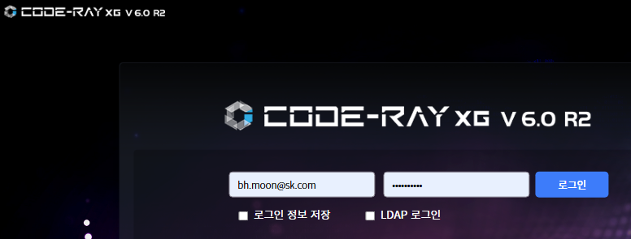
- **우측상단 - 관리 - 연동관리 클릭**\
  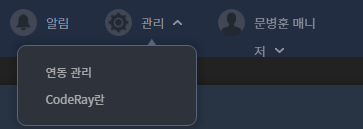
- **연동관리 - 형상관리 인증 정보 클릭 → 우측 `+` 클릭**\
  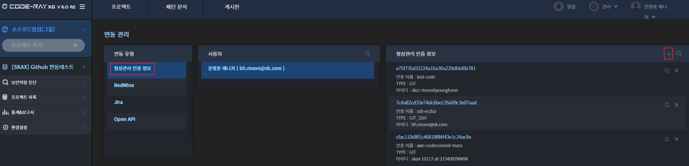
- **인증이름, 아이디, 토큰 입력**\
  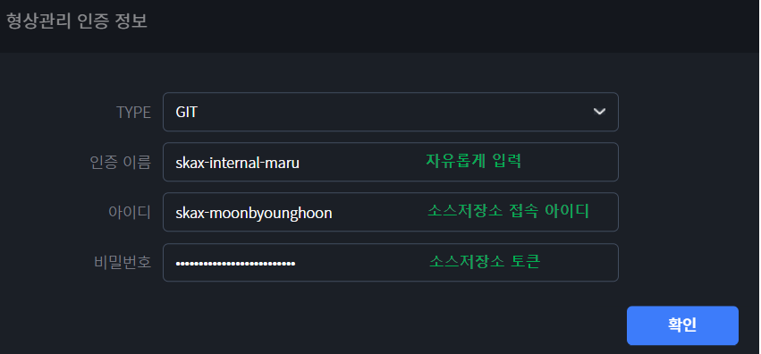
- **생성된 인증정보의 `새로고침` 클릭**\
  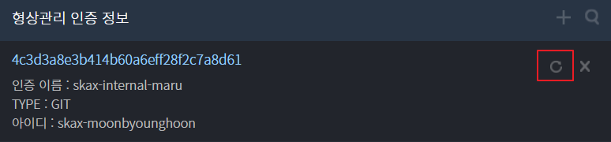
- **GIT 접속 URL 입력 후 `접속 테스트` 클릭**\
  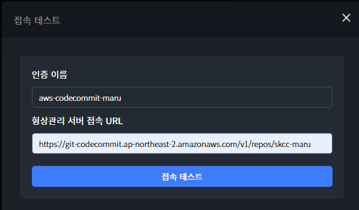
- **접속 성공 시, 아래와 같은 메시지 안내**\
  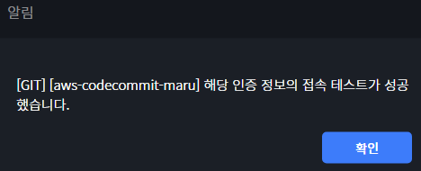\
- **형상관리 인증 정보의 문자열은 `형상관리 인증 KEY`로 사용됩니다.**\
  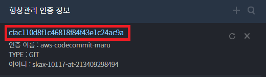

### 2. Open API 접속 KEY 발급

- **우측상단 - 관리 - 연동관리 클릭**\
  
- **연동관리 - Open API 클릭 → 우측 `+` 클릭**\
  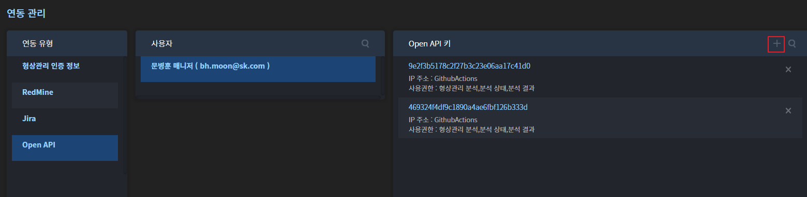
- **Open API 기능(형상관리분석, 분석상태, 분석결과) 선택, 서비스(빌드플랫폼) 선택, 코드레이 로그인 비밀번호 입력후 확인 버튼 클릭**\
  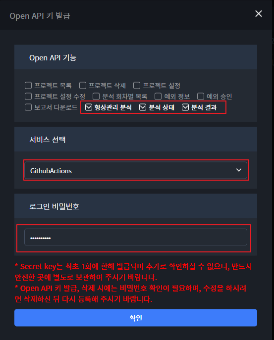
- **생성된 ACCESS Key 및 SECRET Key를 저장**\
  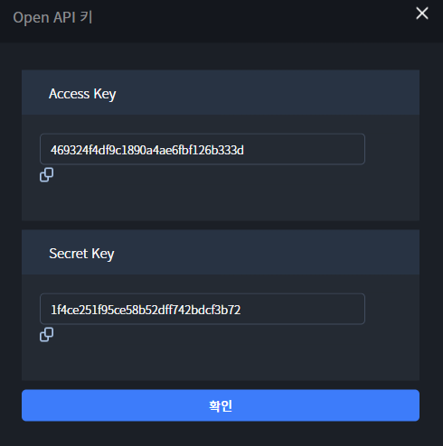

### 3. 코드레이 프로젝트 코드 확인
>
> 코드레이 프로젝트는 소스저장소와 **1:1 맵핑**이 되어야 합니다. \
> 그러지 않을 경우 증분분석 기능이 동작되지 않아 분석시간이 증가 됩니다. \
> 코드레이 프로젝트 생성은 `정보보호팀`에게 연락 바랍니다.
>
- **코드레이 프로젝트 코드 확인**\
  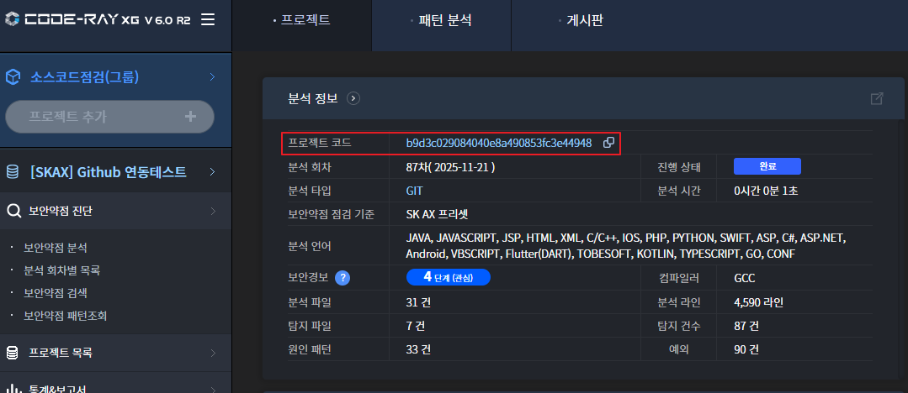

### 4. CICD 파이프라인에 코드레이 분석 단계 추가
>
> 기존 빌드 스텝에서 `코드레이 분석 단계만 추가`합니다.\
> 코드레이 연계는 기본적으로 **Docker 이미지 실행** 방법을 기본으로 합니다. \
> Docker 이미지 실행이 불가한 경우에는 **Jar 실행** 방법을 사용하면 됩니다. \
> CICD 파이프라인에서 실행 파라미터는 빌드 플랫폼 내의 `변수 또는 시크릿` 기능을 활용하여도 무방합니다.\

### 도커 이미지 및 JAR 정보
>
> Docker Image와 Jar 파일 주소는 하단 정보를 확인 바랍니다. \
> **외부에서도** 접근 가능하도록 되어 있으나 \
> 폐쇄된 공간에 빌드서버가 존재하는 경우 **방화벽신청** 또는 **nexus 서버**(사용시)에 업로드하여 사용하시면 됩니다.

구분 | 주소
--|--
Docker Image|ghcr.io/skccmygit/coderay-openapi:latest
Jar|<https://github.com/skccmygit/skax-coderay-guide/releases/download/latest/coderay-open-api.jar>
  
#### 4-1. `Docker Image` 이용 예제 (GitActions workflow 이용)
>
> 기존의 workflow.yml 파일 내용에서 `Coderay 분석 단계`만 추가하면 됩니다. \
> Github Actions **variable 및 secret**을 이용한 예제입니다. \
> workflow 구성은 각 프로젝트에 맞게 만들면 됩니다. (Job 또는 Step 구성)

- 아래는 Step 구성으로 호출한 샘플 입니다.
- 체크아웃-빌드-**코드레이도커이미지풀-코드레이분석**-배포

  ```yml
  jobs:
    build:
      runs-on:
        group: organization/internal-runner-linux
      steps:
        - name: Checkout
          uses: actions/checkout@v3

        - name: Build
          run: |
            echo "===== Build Stage ====="
            echo "빌드 수행"
        
        - name: 코드레이 Docker Image Pull
          run: docker pull ${{ vars.CODERAY_IMAGE_NAME }}

        - name: 코드레이 분석 요청
          run: |
            docker run --rm \
              --name coderay-open-api \
              -e SERVICE_NAME=${{ vars.CODERAY_SERVICE_NAME }} \
              -e ACCESS_KEY=${{ vars.CODERAY_ACCESS_KEY }} \
              -e SECRET_KEY=${{ vars.CODERAY_SECRET_KEY }} \
              -e PC_CODE=${{ vars.CODERAY_PC_CODE }} \
              -e ACC_CODE=${{ vars.CODERAY_ACC_CODE }} \
              -e SRC_URL=${{ github.server_url }}/${{ github.repository }} \
              -e REV=refs/heads/${{ github.event.inputs.environment || github.ref_name }} \
              ${{ vars.CODERAY_IMAGE_NAME }}

        - name: Deploy
          run: |
            echo "Deploy Stage"
            echo "배포 수행"
  ```

#### 4-2. `Jar` 이용 예제 (GitActions workflow 이용)
>
> 기존의 workflow.yml 파일 내용에서 `Coderay 분석 단계`만 추가하면 됩니다. \
> Github Actions **variable 및 secret**을 이용한 예제입니다. \
> workflow 구성은 각 프로젝트에 맞게 만들면 됩니다. (Job 또는 Step 구성)

- 아래는 Step 구성으로 호출한 샘플 입니다.
- 체크아웃-빌드-**코드레이JAR다운로드-코드레이분석요청**-배포)

  ```yml
  jobs:
    build:
      runs-on:
        group: organization/internal-runner-linux
      steps:
        - name: Checkout
          uses: actions/checkout@v3

        - name: Build
          run: |
            echo "===== Build Stage ====="
            echo "빌드 수행"
        
        - name: 코드레이 JAR 다운로드
          run: |
            curl -L -O \
              https://github.com/skccmygit/skax-coderay-guide/releases/download/latest/coderay-open-api.jar
            
        - name: 코드레이 분석 요청
          run: |
            java -jar coderay-open-api.jar \
              --SERVICE_NAME=${{ vars.CODERAY_SERVICE_NAME }} \
              --ACCESS_KEY=${{ vars.CODERAY_ACCESS_KEY }} \
              --SECRET_KEY=${{ vars.CODERAY_SECRET_KEY }} \
              --ACC_CODE=${{ vars.CODERAY_ACC_CODE }} \
              --PC_CODE=${{ vars.CODERAY_PC_CODE }} \
              --SRC_URL=${{ github.server_url }}/${{ github.repository }} \
              --REV=refs/heads/${{ github.event.inputs.environment || github.ref_name }} \
            echo "Coderay 상세 결과는 https://skax.coderay.co.kr:28443 에서 확인하세요"

        - name: Deploy
          run: |
            echo "Deploy Stage"
            echo "배포 수행"
  ```

### 5. 코드레이 사이트에서 결과 확인

- **코드레이 결과확인 (좌측 분석회차별 목록 클릭하여 확인)**
  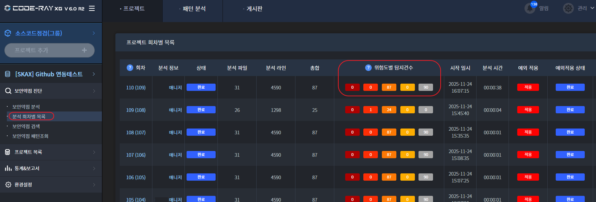

## 참고사항

- 도커이미지 또는 JAR에 사용되는 환경변수 설명

  | 환경변수명 | 필수여부 | 설명 | 기본값 |
  |--------|--------|------|------|
  | **SERVICE_NAME** | **필수** | OpenAPI 생성시 선택한 빌드 플랫폼명 | |
  | **ACCESS_KEY** | **필수** | OpenAPI 생성시 취득한 Access Key | |
  | **SECRET_KEY** | **필수** | OpenAPI 생성시 취득한 Secret Key | |
  | **PC_CODE** | **필수** | 코드레이 프로젝트 코드 | |
  | **ACC_CODE** | **필수** | 형상관리 인증 KEY | |
  | **SRC_URL** | **필수** | 소스저장소 URL | |
  | **REV** | **필수** | `refs/heads/`+ **분석 대상 브랜치명** | |
  | TIMEOUT_SECONDS | 옵션 | 코드레이 스캔 타임아웃 시간(초) | 600 |
  | SERVER_URL | 옵션 | 코드레이 Open API URL | <https://coderay.skax.co.kr:28443> |
  | SUB_MODULE | 옵션 | 분석시 서브모듈 포함 여부 | y |
  | EXCEPT | 옵션 | 분석시 예외 적용 여부 | y |
  | ALL_SAVE | 옵션 | 분석시 전체 저장 여부 | y |
  | INCREMENTAL | 옵션 | 분석시 증분 분석 여부 | y |
  | PRECISE_ANALYSIS | 옵션 | 분석시 정밀 분석 여부 | y |
  | CRITICAL_CNT | 옵션 | Critical(심각) 허용 개수 | 0 |
  | CRITICAL_ALLOW | 옵션 | Critical(심각) 이관 제어(n:skip) | y |
  | HIGH_CNT | 옵션 | High(높음) 단계 허용 개수 | 0 |
  | HIGH_ALLOW | 옵션 | High(높음) 이관 제어(n:skip) | y |
  | MIDDLE_CNT | 옵션 | Middle(중간) 허용 개수 | 0 |
  | MIDDLE_ALLOW | 옵션 | Middle(중간) 이관 제어(n:skip) | n |
  | LOW_CNT | 옵션 | Low(낮음) 허용 개수 | 0 |
  | LOW_ALLOW | 옵션 | Low(낮음) 이관 제어(n:skip) | n |

- 코드레이 **최초 연동시**에는 분석시간이 오래 걸릴 수 있습니다.\
  최초 이후 분석의 경우 `증분대상`만 분석합니다.
