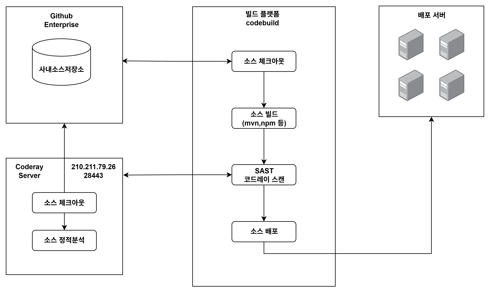
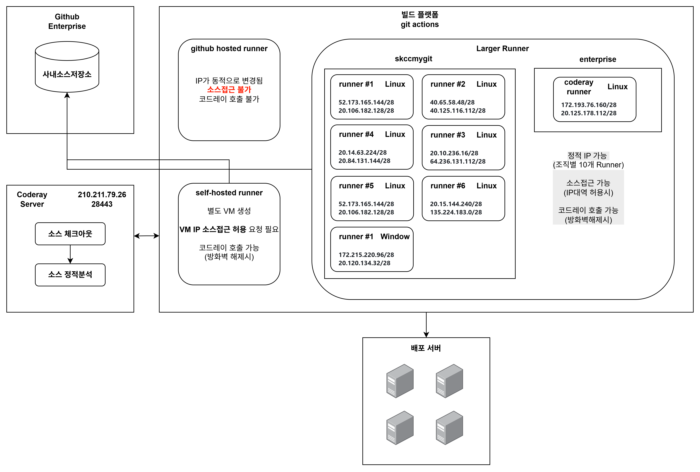
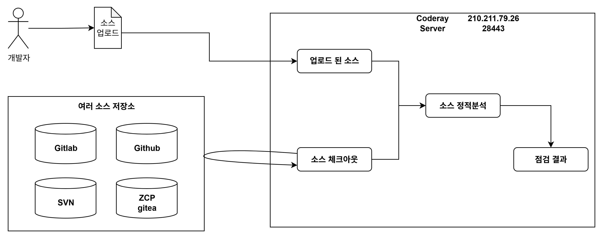
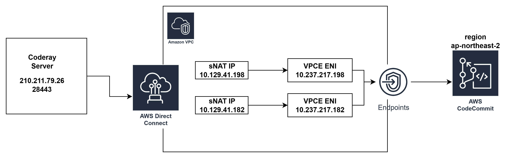

# DevSecOps 관련사항

본 자료는 DevSecOps를 추진하면서 검증한 내용들에 대한 설명한 일종의 making 이력입니다.

> DevSecOps 구현을 위해 검증 및 작업한 내용
>
- [X] 코드레이 CLI 방식 POC
- [X] 코드레이 Open API 구조 설계 및 구현 지원 (/w 솔루션 업체) 
- [X] 사내시스템 DevSecOps 구현을 위한 현황 파악
- [X] 사내시스템 DevSecOps 구현 지원

## DevSecOps
>
> DevOps 개념에서 보안자동화까지 넣은 개념

## 코드레이란?
>
> SK AX에서 정적소스분석 도구로 사용하는 `트리니티소프트`사의 솔루션 제품임. \
> 1년에 한번 수동으로 점검을 수행하였음. \
> 여러 IDE에 Plugin을 제공하고는 있으나 많이는 사용하고 있지는 않은 듯 합니다. \
> 제품자체가 On-Prem 환경에 최적화 되어 있는듯 함.

## 코드레이 호출 방식
>
> 3가지 종류가 있습니다. \
> `수동`, `CLI`, `Open API` CLI 방식은 파일럿 개념으로 테스트 진행하였고, 최종적으로는 Open API 방식을 검증 및 구현하였습니다.
>

### CLI 호출
>
> 업체에서 제공해준 Jar 및 Properties 파일을 통하여 코드레이 분석 \
> 지금와서 생각해보면 OpenAPI의 Wrapper JAR 와 기능이 똑같다고 생각됨 \
> 호출하는 IP를 코드레이 관리자 화면에 등록 해줘야 함 \
> 복잡한 연계 및 업무별로 구현해야 할 내용이 많아서 적합하지 않은 것으로 판단하였으며 (별도 서버 필요 등...)
> 최종적으로 CLI 방식은 사용하지 않는 것으로 결론

### OpenAPI 호출
>
> 일반적인 API 호출을 통하여 기능 제공 \
> 단, 분석요청 기능이 없어 이번 `DevSecOps 구축`을 하면서 업체에서 개발해줌 \
> `분석`, `상태조회`, `결과조회` 3가지 API가 추가 개발 되었음 \
> 실제 파이프라인에서 사용하려고 하니 복잡하였음 (3가지 API를 각각 호출하려다보니 복잡) \
> 3가지 API를 묶은 기능을 자체개발 하였음 (`30.소스` 폴더 확인)

- 처음에는 node 및 java 버전을 만들어 보기만 하였음
  - ROOT에서 `coderay-open-api` 폴더 내용
- `여러 빌드 플랫폼`에서 사용하기 편한 방법을 고민하였고
- Docker Image 실행 방법 사용시 별도 파일 반입 없이 사용이 가능하다고 판단함.
- Docker Image Registry 는 Github Container Registry 를 사용해도 됨다고 판단.

## 사내시스템 빌드환경 파악
>
> 정적분석을 자동화 하기위해선 기존 Pipeline에 `SAST 스텝`을 추가해야 함 \
> 따라서, 사내시스템 CICD 환경 파악이 우선시 되어야 했으며, \
> 파악한 결과 **AWS, ZCP, 로컬빌드** 등이 있었음. \
> 궁극적인 목표는 DevSecOps 성숙도를 Level 3으로 올리는 것이었으며 \
> 소스저장소가 없으면 소스저장소(Github)를 사용 해야하고 \
> 배포 자동화가 안되어 있으면 배포 파이프라인을 구축하는 것이 궁극적인 목표입니다.

### AWS 빌드환경 (codebuild & codepipelines)
>
> AWS 환경의 경우 Codecommit - Codebuild - CodePipelines 사용하여 DevOps를 이미 구축하여 사용하고 있었습니다. \
> 따라서, Codepipeline에 `SAST분석` 단계만 추가하면 되었으나\
> 방화벽 작업이 필요합니다.

- AWS 환경에서의 코드레이 호출 흐름
    
- 방화벽 관련 정책
  1. **Codebuild에서 Github 소스저장소 접근**\
     AWS Codebuild의 IP가 변경되기 때문에 IP를 하나하나 등록하기 어려움\
     따라서, Github **AWS Connector App**을 설치하고 해당 APP을 Allow IP 등록 함
  2. **Codebuild에서 코드레이서버 접근**\
     Codebuild의 Region별 IP Range는 존재함. (tools-ip-range-check 폴더 확인) \
     예시) 출발지: AWS Codebuild, 도착지: 코드레이서버 (210.211.79.26/28443)
  3. **Coderay서버에서 소스저장소**
     - Github 조직별 Allow IP 정책에 코드레이 서버 IP 등록해야 함
     - 소스저장소가 Github로 통일되면서 Github로 방화벽만 뚫으면 됨(작업완료)

### Git Actions 환경
>
> Git Actions 같은 경우에는 여려 Runner를 사용할 수 있음. \
> Runner Type으로는 3가지가 존재함 \
> `Github hosted Runner`, `Larger Runner`, `self-hosted Runner` 사용을 할 수 있음. \
> Larger Runner의 경우 특히 `static IP` 기능을 지원하며, 조직당 10개까지만 생성할 수 있음. \
> self-hosted runner의 경우 자체 빌드서버를 구축하는 개념

- Git Actions 환경에서의 코드레이 호출 흐름
  - 조직별 allow IP 정책으로 인하여 다소 복잡할수 있음
   
  - Enterprise Runner의 경우 코드레이 호출전용임\
   예를들면 코드레이 점검용 workflow만 만들수도 있음

## [참고자료] - 코드레이 솔루션 동작방식
>
> 코드레이의 경우 아래 그림과 같이 `2가지 방법`으로 소스 분석을 진행할 수 있음. \
> DevSecOps 구축 전까지는 1년에 한번정도 **수동으로 소스를 업로드** 하여 점검 진행
>


- 수동 업로드
  - 사내망(?)에서는 [코드레이 사이트](https://coderay.skax.co.kr:28443) 접근 가능 
  - zip파일로 압축하여 올렸다고 함
- 코드레이 서버에서 소스저장소 접근 후 소스체크아웃
  - 코드레이 CLI 및 Open API의 `근본`이 되는 기능
  - 코드레이 서버 → 소스저장소 접근이 되어야 하므로 **방화벽 설정**이 필요함
    - Github의 경우 방화벽해제 신청 및 코드레이 서버에 /etc/hosts 작업을 진행 함 \
      또한, **Gtihub Allow IP 정책이 활성화** 되어 있을 경우 **코드레이서버 아이피를 등록**해야 함
    - AWS Codecommit의 경우 Direct Connection을 통하여 접근하였음 \
      /etc/hosts에 NAT IP 코드커밋도메인 등록
      

- 코드레이는 `증분스캔` 기능이 존재 함 \
  해당 기능의 경우 이전 분석이력에서 변경된 부분만 분석하기 때문에 시간이 적게 소비 됨 \
  단, 분석시 소스의 `디렉토리구조`가 동일해야 함. 다를 경우 최초분석으로 판단한다고 함

- 현재는 코드레이 프로젝트명칭이 시스템명이랑 동일함. \
  만약, 여러개 Repository를 가진 시스템일 경우 앞에 설명한 내용으로 인하여 분석속도가 느릴 가능성이 높음. \
  따라서, Repostiory와 코드레이 프로젝트를 1:1 맵핑 해야 함

## [참고내용]
>
> DevSecOps 구축을 지원하는 역할이 아닌 POC(?) 하는 역할이 맞음 \
> 전사 DevSecOps 현황은 파악하고, 안되어 있는 관계사의 경우 가이드라인만 주면 되는 역할 같음 \
> 하지만, AI Inovation 본부가 관리하는 `사내시스템` 조차도 안되어 있어서 도와주려다보니 업무역할이 DevSecOps 구축 업무가 주가 된 느낌이 강함

## [참고] 코드레이 업체에서 제공한 도커 이미지 업로드
- 도커 이미지를 사용한 이유 : 도커 이미지를 사용 안하면 업체에서 제공한 jar 파일을 각 프로젝트 소스에 포함시켜서 빌드 파이프라인을 구축해야 함 
- 도커 이미지를 사용하면 시스템별로 빌드 때마다 다운로드하여 사용 가능.
- 사내 표준저장소 ghcr에 올려서 깃허브 Action Runner 및 AWS Codebuild 등에서 접근 가능 (public으로 열어 둔 상태이며, 보안적으로 문제 없음을 업체에서 확인 받음) 
- 단, ZCP쪽은 사내 시스템에서 쓸 수 있도록 자체 이미지 저장소에 올림

```bash
# 서버로그인하여 TAR 올리기
sudo docker load -i coderay-open-api.tar

## 이미지 Re-Tag 
docker tag coderay-open-api:latest ghcr.io/skccmygit/coderay-open-api:latest
docker tag coderay-open-api:latest ghcr.io/skax-internal/coderay-open-api:latest

## 도커 ghcr.io 로그인
docker login ghcr.io -u skccmygit
docker login ghcr.io -u skax-internal-system
토큰 입력

## 푸시
docker push ghcr.io/skccmygit/coderay-open-api:latest
docker push ghcr.io/skax-internal/coderay-open-api:latest
```
